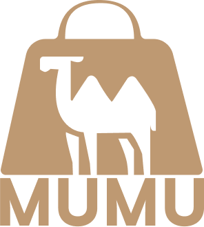

    

## Mumu Market (Waitlist)

This is the waitlist for Mumu Market, a platform for Muslim owned small-businesses to sell their products through a referral based system and build exposure for their brands.

## Features

> TODO: List every potential and implemented / committed feature here without going into too much detail.

> TODO: Add a video here that showcases all of the features of the application and potential MVP.

## Contributing

Please read [CONTRIBUTING.md](CONTRIBUTING.md) for details on our code of conduct, and the process for submitting pull requests to us.

## License

This project is licensed under the GNU General Public License v3.0 - see the [LICENSE](LICENSE) file for details.